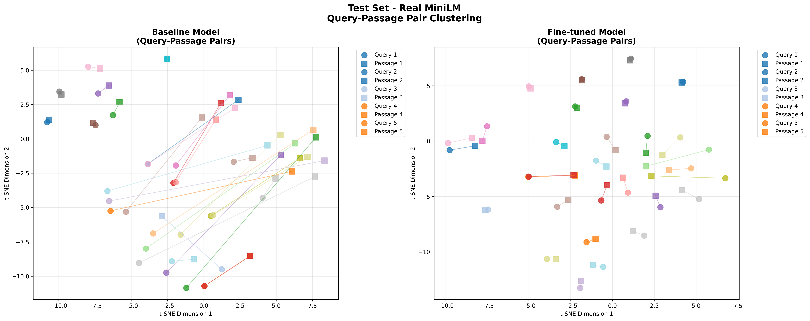

# D&D Dungeon Master Copilot: A Context-Aware RAG System for Improvisational Gameplay

**Course:** BU CS 506 - Final Project  
**Team:** Garry Kuwanto  
**Midterm Report:** October 27, 2024

## 📹 Midterm Presentation Video

## 📊 Midterm Report - Preliminary Results

### Data Processing Pipeline
We successfully processed the **m0no1/dnd-mechanics-dataset** from Hugging Face, containing 40,365 D&D 3.5 mechanics question-answer pairs. Our data processing pipeline includes:

- **Train/Validation/Test Splits:** Implemented proper 80/10/10 data splits for fair evaluation
- **Data Loading Infrastructure:** Created reusable data loading utilities with proper preprocessing

### Modeling Methods
We fine-tuned the **sentence-transformers/all-MiniLM-L6-v2** model using:

- **Training Strategy:** Contrastive learning with MultipleNegativesRankingLoss
- **Framework:** sentence-transformers library in Python
- **Training Duration:** 5 epochs (2525 steps) with evaluation tracking
- **Experiment Tracking:** Weights & Biases integration for monitoring training progress

### Preliminary Results
Our fine-tuned model shows **signnificant improvements** over the baseline across all key metrics:

| Metric | Baseline | Fine-tuned | Improvement |
|--------|----------|------------|-------------|
| **Accuracy@1** | 34.8% | **68.2%** | **+96%** |
| **Accuracy@3** | 50.0% | **78.2%** | **+56%** |
| **Accuracy@5** | 55.5% | **82.6%** | **+49%** |
| **MRR@10** | 43.5% | **74.9%** | **+72%** |

### Visual Evidence: Query-Passage Pair Clustering
Our t-SNE visualization of query-passage pairs demonstrates the model's improved semantic understanding:

**Key Observations:**
- **Baseline Model (Left):** Query-passage pairs are scattered with long connecting lines, indicating poor semantic alignment
- **Fine-tuned Model (Right):** Query-passage pairs cluster much closer together with shorter connecting lines, showing improved semantic understanding
- **Visual Improvement:** The fine-tuned model successfully brings related queries and passages into proximate regions of the embedding space
- **Quantitative Validation:** This visual evidence directly supports our quantitative metrics showing 72% improvement in MRR@10

### Training Progress
The validation MRR score shows consistent improvement throughout training, reaching convergence around 0.725 after 2,500 steps, demonstrating stable learning without overfitting.

### Key Findings
1. **Significant Performance Gains:** Our fine-tuned model achieves 96% improvement in Accuracy@1, demonstrating successful domain adaptation
2. **Visual Confirmation:** t-SNE plots provide clear visual evidence of improved query-passage semantic alignment
3. **Stable Training:** Validation metrics show consistent improvement without overfitting
4. **Reproducible Pipeline:** Complete training and evaluation pipeline ready for replication

### Preliminary Code Implementation
Our project repository contains comprehensive preliminary code demonstrating the complete pipeline:

- **`dnd_dm_copilot/training/finetune.py`** - Complete training pipeline with data loading, model fine-tuning, and evaluation
- **`dnd_dm_copilot/visualization/embedding_analysis.py`** - Visualization script for query-passage pair clustering analysis

### Next Steps
- **RAG Integration:** Build full retrieval-augmented generation system using fine-tuned embeddings
- **Dataset Expansion:** Integrate additional D&D datasets (FIREBALL, CRD3) for broader coverage
- **Qualitative Evaluation:** Create challenge set with diverse D&D scenarios for human evaluation

## Project Description

This project aims to create a D&D Dungeon Master copilot tool that acts like Cursor for code - providing intelligent, context-aware assistance to help DMs improvise on the fly. The system will use a specialized RAG pipeline to retrieve relevant information from campaign notes, game mechanics, and similar situations from other campaigns to support real-time decision making.

### Problem Statement

Dungeon Masters face constant pressure to improvise and make quick decisions during gameplay. They need to:
- Remember complex campaign lore and NPC details
- Apply game mechanics correctly in dynamic situations  
- Draw inspiration from similar scenarios in other campaigns
- Maintain narrative consistency while adapting to player choices

Current tools are either too generic (general D&D wikis) or too static (campaign notes), failing to provide context-aware assistance for real-time improvisation.

### Proposed Solution

We will create a DM copilot tool that combines:
- **Campaign-Specific Knowledge:** Current campaign notes, NPCs, locations, plot threads
- **Mechanics Database:** Rules, spells, abilities, and their contextual applications
- **Cross-Campaign Inspiration:** Similar situations from other campaigns for creative ideas
- **Context-Aware Retrieval:** Understanding of current game state and narrative context

The system will provide instant, relevant suggestions to help DMs make informed decisions on the fly.

## Project Goals

### Primary Goal
Create a specialized retrieval system that can accurately find relevant information from multiple D&D knowledge sources to support a DM copilot tool. The focus is on training a high-quality embedding model for retrieval, while keeping the generation component fixed.

### Success Criteria
- **Retrieval Quality:** Fine-tuned embedding model achieves statistically significant improvement in retrieval accuracy over baseline
- **Multi-Source Capability:** System can effectively search across campaign notes, mechanics, and cross-campaign data
- **Context-Aware:** Retrieval understands D&D-specific context and relationships
- **Reproducible:** Complete training pipeline that others can use to fine-tune embedding models for other domains

## Data Collection Plan

We will create a multi-source knowledge base from the following sources:

### Training Data Sources
1. **D&D Mechanics Dataset (Hugging Face):** 40,365 D&D 3.5 mechanics question-answer pairs for learning game rules
2. **FIREBALL Dataset (Hugging Face):** ~25,000 unique D&D sessions from Discord gameplay for cross-campaign inspiration
3. **CRD3 Dataset (GitHub):** 398,682 turns from 159 Critical Role episodes for narrative techniques

### Evaluation Data Sources
4. **Asylum Tapes Campaign (Reddit):** 9 detailed session logs from r/TalesFromDrexlor for campaign-specific testing
5. **Personal Campaign Notes (Stretch Goal):** Notes from campaigns and one-shots for authentic DM scenario testing

### Data Processing
- Use DeepSeek V3.1 for LLM-enhanced preprocessing to improve data quality
- Convert all sources into (query, passage) pairs for contrastive learning
- Generate realistic DM queries and relevant information chunks

*Detailed data processing strategies are documented in [DATA_SOURCES.md](docs/DATA_SOURCES.md)*

## Modeling Plan

### Base Model
- **Options:** sentence-transformers/all-MiniLM-L6-v2 or Qwen3 Embeddings 0.6B
- **Selection:** Will evaluate both models during initial experimentation phase

### Training Approach
- **Framework:** sentence-transformers library in Python
- **Strategy:** Contrastive learning with MultipleNegativesRankingLoss
- **Process:** Fine-tune embedding model to understand D&D-specific semantic relationships

### System Architecture
- **Retrieval Component:** Fine-tuned embedding model for multi-source search
- **Generation Component:** Fixed LLM (GPT-4, Claude) for text generation
- **Focus:** This project focuses on improving retrieval quality, not generation

*Detailed technical implementation is documented in [TECHNICAL_DETAILS.md](docs/TECHNICAL_DETAILS.md)*

## Visualization Plan

### Exploratory Analysis
- **Word Clouds:** Show most frequent D&D terms in the dataset
- **Data Distribution:** Visualize data across different sources

### Embedding Space Analysis
- **t-SNE/UMAP Plots:** 2D visualizations of embedding space for D&D terms
- **Semantic Clusters:** Compare base model vs. fine-tuned model to show improved clustering
- **Example Terms:** 'Fireball', 'Lich', 'Paladin', 'Attack Roll', 'Saving Throw'

### Performance Visualization
- **Metric Comparisons:** Bar charts comparing MRR and Recall@k scores
- **Retrieval Examples:** Side-by-side comparison of top-3 retrieved results

## Test Plan

### Quantitative Evaluation
- **Holdout Test Set:** 15% of dnd-mechanics-dataset (~6,000 pairs)
- **Metrics:** Mean Reciprocal Rank (MRR) and Recall@k (k=1, 3, 5)
- **Baseline Comparison:** Compare fine-tuned model against base model

### Qualitative Evaluation
- **Challenge Set:** 20-30 manually crafted diverse DM scenarios
- **Retrieval Quality:** Compare top-3 retrieved results for relevance and accuracy
- **Multi-Source Testing:** Evaluate retrieval across different knowledge sources

### Statistical Significance
- Use appropriate statistical tests to determine if improvements are significant
- Report confidence intervals for all metrics

## Project Timeline

### Phase 1: Data Collection and Preparation (Weeks 1-3)
- Download and explore all datasets
- Implement data processing pipeline
- Create training pairs from all sources

### Phase 2: Model Development (Weeks 4-6)
- Set up training environment
- Implement fine-tuned embedding model
- Train and iterate on model parameters

### Phase 3: Evaluation and Analysis (Weeks 7-8)
- Implement evaluation metrics
- Run quantitative and qualitative evaluation
- Generate visualizations

### Phase 4: Documentation and Finalization (Weeks 9-10)
- Document results and findings
- Create reproducible pipeline
- Prepare final presentation

*Detailed implementation plan is documented in [IMPLEMENTATION_PLAN.md](docs/IMPLEMENTATION_PLAN.md)*

## Expected Outcomes

By the end of this project, we expect to have:

1. **A fine-tuned embedding model** that shows measurable improvement in D&D-specific retrieval tasks
2. **Comprehensive evaluation results** demonstrating the model's capabilities and limitations
3. **Visualizations** showing the learned semantic structure of D&D concepts
4. **A reproducible pipeline** that others can use to fine-tune embedding models for other domains
5. **Documentation** of the full data science lifecycle from data collection to model evaluation

This project will demonstrate the value of domain-specific fine-tuning for specialized applications and provide insights into how to effectively combine multiple data sources for training embedding models.

---

## Additional Documentation

- **[DATA_SOURCES.md](docs/DATA_SOURCES.md)** - Detailed information about data sources and processing strategies
- **[TECHNICAL_DETAILS.md](docs/TECHNICAL_DETAILS.md)** - Technical implementation details and system architecture
- **[IMPLEMENTATION_PLAN.md](docs/IMPLEMENTATION_PLAN.md)** - Detailed project timeline and implementation phases