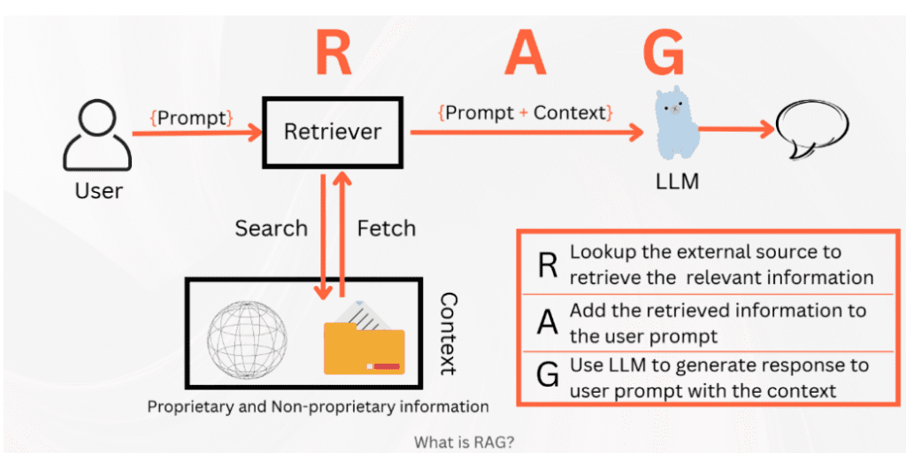

# D&D Dungeon Master Copilot
## A Context-Aware RAG System for Improvisational Gameplay

**CS 506 Final Project - Midterm Presentation**  
**Garry Kuwanto**  
**October 27, 2024**

---

## What is RAG?

*Image source: [Data Science Central - RAG and its evolution](https://www.datasciencecentral.com/rag-and-its-evolution/)*

**Retrieval-Augmented Generation** gives smaller, faster models access to external knowledge through context.

### Why Do We Care?
- **Efficiency**: Lightweight models + external knowledge = better performance
- **Cost-effectiveness**: No need for massive models
- **Domain-specificity**: Tailored knowledge injection
- **Real-time**: Instant retrieval vs. training data limitations

---

## The DM Problem

Being a Dungeon Master is **overwhelming**.

### Players Do Unconventional Things:
- Cast spells in creative ways
- Negotiate with unprepared NPCs
- Explore undeveloped areas
- Ask unexpected questions

### DMs Need Instant Access To:
- **Game mechanics** - How does this spell work?
- **Campaign lore** - What did that NPC say?
- **Rules clarifications** - Can they actually do that?

### Current Solutions Are Inadequate:
- **Too slow** - Searching through rulebooks
- **Too generic** - General D&D wikis

---

## Project Vision

**This project aims to help DMs** by creating a specialized RAG system that retrieves relevant information instantly, allowing for smooth, informed improvisation.

### Two-Component System:
1. **Mechanics Pipeline** (Current Focus)
2. **Campaign Knowledge Pipeline** (Future Work)

---

## Current Work: Mechanics Pipeline

### Data Processing
- **Dataset**: 40,365 D&D 3.5 mechanics question-answer pairs
- **Source**: Hugging Face (m0no1/dnd-mechanics-dataset)
- **Splits**: 80/10/10 train/validation/test
- **Format**: Query-passage pairs ready for training

### Model Architecture
- **Base Model**: sentence-transformers/all-MiniLM-L6-v2
- **Parameters**: 22M (lightweight and efficient)
- **Training**: Contrastive learning with MultipleNegativesRankingLoss
- **Duration**: 5 epochs (2,525 steps)
- **Tracking**: Weights & Biases integration

---

## Preliminary Results

### Quantitative Improvements
| Metric | Baseline | Fine-tuned | Improvement |
|--------|----------|------------|-------------|
| **Accuracy@1** | 34.8% | **68.2%** | **+96%** |
| **Accuracy@3** | 50.0% | **78.2%** | **+56%** |
| **Accuracy@5** | 55.5% | **82.6%** | **+49%** |
| **MRR@10** | 43.5% | **74.9%** | **+72%** |

### Key Achievement
**96% improvement in Accuracy@1** demonstrates successful domain adaptation

---

## Visual Evidence: Query-Passage Clustering

### Baseline Model (Left)
- Query-passage pairs scattered with **long connecting lines**
- Poor semantic alignment
- Difficult to distinguish related pairs

### Fine-tuned Model (Right)
- Query-passage pairs **cluster closer together**
- **Shorter connecting lines** indicate better semantic understanding
- Clear visual improvement in D&D mechanics comprehension

---

## Code Implementation

### Preliminary Code Available
- **`dnd_dm_copilot/training/finetune.py`** - Complete training pipeline
- **`dnd_dm_copilot/visualization/embedding_analysis.py`** - Visualization script
- **Reproducible pipeline** with proper error handling
- **Dependency management** for consistent results

### Training Progress
- Validation MRR shows consistent improvement
- Convergence around 0.725 after 2,500 steps
- Stable learning without overfitting

---

## Future Vision: Campaign Knowledge

### Separate Model & Data Pipeline
- **Campaign notes** - NPCs, locations, plot threads
- **Session transcripts** - Previous game events
- **Custom lore** - World-building details
- **Character backstories** - Player-specific information

### Complete DM Copilot
Answer both:
- "How does this spell work?" (Mechanics)
- "What did the tavern keeper tell us about the missing merchant?" (Lore)

---

## Key Findings

1. **Significant Performance Gains**: 96% improvement in Accuracy@1
2. **Visual Confirmation**: t-SNE plots show improved semantic alignment
3. **Stable Training**: Consistent improvement without overfitting
4. **Reproducible Pipeline**: Complete training and evaluation system

---

## Next Steps

### Immediate Goals
- **Qualitative Evaluation**: Create challenge set with diverse D&D scenarios
- **RAG Integration**: Build full retrieval-augmented generation system
- **Campaign Knowledge Pipeline**: Separate model for lore and campaign data
- **Dataset Expansion**: Integrate additional D&D datasets (FIREBALL, CRD3)
- **Multi-source Integration**: Combine mechanics, lore, and custom content
- **Real-time DM Assistant**: Complete copilot system for improvisational gameplay

**Thank you!**
